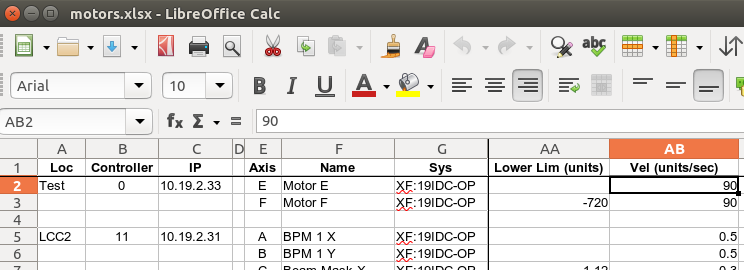
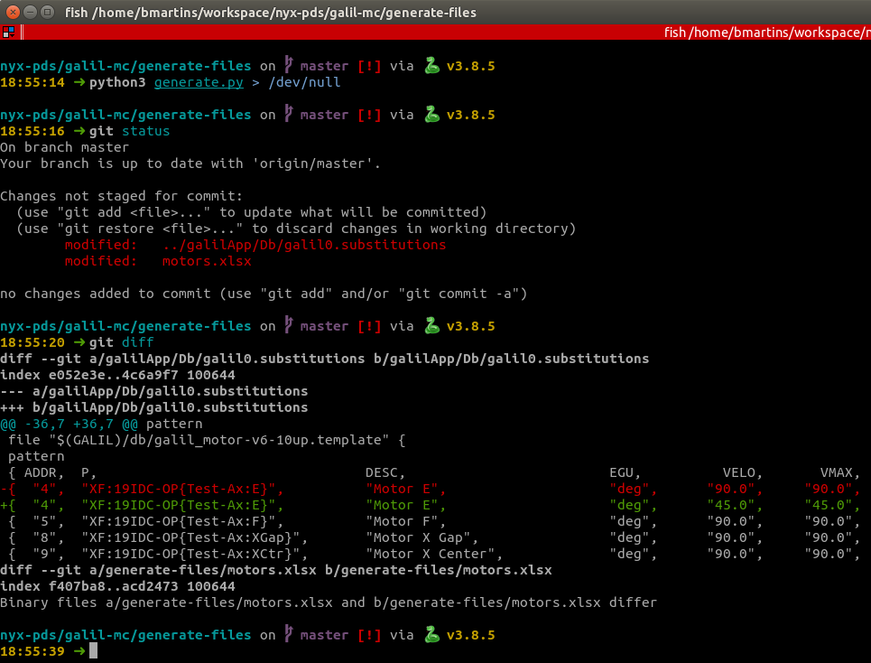

# Galil Motor Controller IOCs for NYX

This IOC depends on the [Galil-3-0 EPICS motor driver](https://github.com/motorapp/Galil-3-0) (mirrored [here]()) developed by the Australian Synchrotron.

This IOC contains database files and startup scripts for NYX Galil motor controllers. Startup scripts and database files are generated via a script based on a spreadsheet.

See more info in the [wiki](https://gitlab.nsls2.bnl.gov/nyx/docs/wikis/galil#galil-mc).

## Re-generating database files and startup scripts

After making changes to the controller and motor specifications in the spreadsheet (located in `generate-files/motors.xlsx`), database files can be re-generated by running the script:

    $ # Install script dependencies. Must be run only once per host.
    $ sudo apt install python3-jinja2 python3-xlrd
    $ # Generate files
    $ cd generate-files
    $ python3 generate.py

This script will create substitutions files in `galilApp/Db/` and IOC startup folder and scripts in `iocBoot/`. Make sure to commit the changes to the git repository afterwards.

**DO NOT** modify the substitutions files and startup scripts manually, as they will be ovewritten by the generation script.

### Example

Let's say you want to change the default speed of the Test Motor E, from 90 deg/sec to 45 deg/sec. The
first step would be to open the spreadsheet and change the appropriate value:

Change the selected cell from 90 to 45 and save the file. The next step is to re-generate the EPICS
files (redirection to `/dev/null` is there just to prevent verbose output):

After running generate.py, note that the file `galil0.substitutions` was changed: the `VELO` and `VMAX`
columns were changed from 90 to 45.

The last step is to commit the changes (if you are happy with them) and rebuild the IOC by running `make`.

Note that this entire process is in place only if you want to keep these changes version controlled.
Nothing prevents you from changing the speed of that motor "live", just by changing the corresponding PVs.
These changes could also be auto-saved so you don't have to worry about committing changes to git,
**but** it is usually my preference to keep them in git so they are easy to rollback or restore in
case you lose your autosave folder.

## Updating the Galil EPICS driver

In order to update the Galil EPICS driver, one must simply pull in the changes to the folder in `/epics/src/Galil-3-0`, recompile it, and then recompile this repository (in `/epics/src/galil-mc`).

## Vector Scan

Consult the [Vector Scan document](VECTOR.md) for more information.