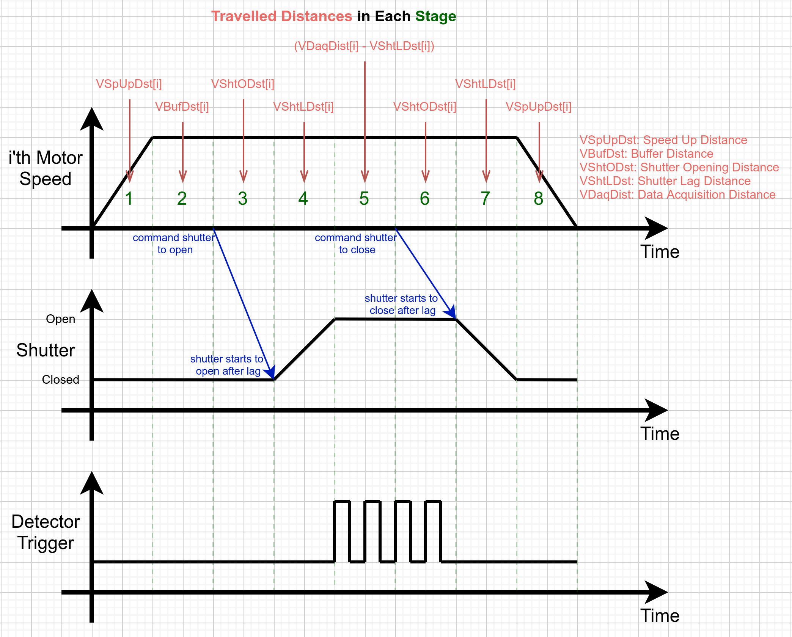

# Vector Scanning

A Vector Scan is a coordinated motion of four motors: Omega, Sample X, Sample Y and Sample Z,
as well as a Shutter. For NYX, this is implemented as a Galil program, called `#VEC`, in the
Galil #2 controller, used to drive Goniometer motors.

_TODO: add screenshot of OPI_

## Theory of operation

The Vector Scan motion program takes four motors from a given start position to a given end
position in a given duration. The program ensures all motors start and end at the exact same
time. The calculated motion profile has a few stages:

| # | Stage            | Condition               | Motors         | Shutter Command | Detector | Description
|---|------------------|-------------------------|----------------|-----------------|----------|-------------
| 0 | Back up          | Always                  |                |                 |          | Move all motors to their overall starting position
| 1 | Speed up         | Always                  | Speed up       |                 |          | Bring all motors up to constant speed
| 2 | Buffer           | If Buffer Time > 0      | Constant speed |                 |          | Wait for stabilization
| 3 | Shutter Open     | Always                  | Constant speed | Open            |          | Open shutter
| 4 | Shutter Lag      | If Shutter Lag Time > 0 | Constant speed |                 |          | Wait for shutter lag
| 5 | Data Acquisition | Always                  | Constant speed |                 | Trigger  | Trigger the detector
| 6 | Shutter Close    | Always                  | Constant speed | Close           |          | Close shutter
| 7 | Shutter Lag      | If Shutter Lag Time > 0 | Constant Speed |                 |          | Wait for shutter lag
| 8 | Stop motors      | Always                  | Slow down      |                 |          | Bring motors to a stop

The following diagram shows each Vector Scan stage and events as a function of time:

### Special Parameters

A handful of special parameters control how the Vector Scan motion program behaves:

* `VClcOnly`: "Calculation Only". If set to `1`, the Vector Scan will calculate the distances
and finish without moving any motors.
* `VExpose`: "Expose". If set to `0`, the Vector Scan *will not* open the shutter.
* `VHold`: "Hold before start". If set to `1`, the Vector Scan will back up the motors and
*wait* until `VProceed` is set to `1`.

### Error Conditions

* **Aborted**: the motion was aborted before it could finish.
* **Zero Exposure**: no exposure was specified; either `VExp` or `VNumSamp` was set to `0`.
* **Too Fast**: requested motion was too fast for one or more motors. Slow down the acquisition by increasing `VExp` or `VNumSamp`.
* **Zero Shutter**: shutter opening time was specified as `0`.
* **Too Slow**: _Galil Limitation_: one of the PVT segments was too slow. In the future, long PVT segments can be broken up into smaller
segments to avoid this error, but for now this will error.

## Parameters

A Vector Scan run can be configured via PVs, which correspond to variables in the `#VEC`
program that runs inside the Galil.

### Global Parameters

| Var Name   | Read PV                 | Write PV             | Description                                                                  |
|------------|-------------------------|----------------------|------------------------------------------------------------------------------|
| `VState`   | `Sts:State-Sts`         |                      | Program state: Idle, Backup, Holding or Acquiring                            |
| `VRunning` | `Sts:Running-Sts`       |                      | Whether a Vector scan is in progress                                         |
| `VError`   | `Sts:Error-Sts`         |                      | Vector error: None, Aborted, Zero Exposure, Too Fast, Zero Shutter, Too Slow |
| `VGo`      |                         | `Cmd:Go-Cmd`         | Start vector scan                                                            |
| `VProceed` |                         | `Cmd:Proceed-Cmd`    | Proceed paused motion                                                        |
| `VAbort`   |                         | `Cmd:Abort-Cmd`      | Abort motion                                                                 |
| `VExpose`  |                         | `Expose-Sel`         | Should expose? 1=expose, 0=don't                                             |
| `VHold`    |                         | `Hold-Sel`           | Should wait for proceed? 1=yes                                               |
| `VClcOnly` |                         | `CalcOnly-Sel`       | Should only calculate positions? 1=yes                                       |
| `VNumSamp` | `Val:NumSamp-I`         | `Val:NumSamp-SP`     | Number of samples in data collection                                         |
| `VExp`     | `Val:Exposure-I`        | `Val:Exposure-SP`    | Exposure per sample (ms)                                                     |
| `VShtOPos` | `Pos:Opn-I`             | `Pos:Opn-SP`         | Shutter open position (EGU) (for galvo)                                      |
| `VShtCPos` | `Pos:Cls-I`             | `Pos:Cls-SP`         | Shutter closed position (EGU) (for galvo)                                    |
| `VShtOTim` | `Val:ShutTime-I`        | `Val:ShutTime-SP`    | Shutter opening/closing time (ms)                                            |
| `VShtLTim` | `Val:ShutLagTime-I`     | `Val:ShutLagTime-SP` | Shutter lag time (ms)                                                        |
| `VBufTime` | `Val:BufferTime-I`      | `Val:BufferTime-SP`  | "Buffer" motion time (ms)                                                    |
| `VDaqDur`  | `Val:DataAcqDuration-I` |                      | Calculated data acquisition duration (ms)                                    |
| `VMxTToSp` | `Val:MaxTimeToSpeed-I`  |                      | Calculated max time necessary to reach desired speeds (ms)                   |

### Per-motor Parameters

Below, `i` is an index between `0` and `3`, `$(Ax)` is one of `O`, `X`, `Y` or `Z`, respectively.

| Var Name      | Read PV               | Write PV                  | Description                                  |
|---------------|-----------------------|---------------------------|----------------------------------------------|
| `VStart[i]`   | `Pos:$(Ax)Start-I`    | `Pos:$(Ax)Start-SP`       | Starting position (EGU)                      |
| `VEnd[i]`     | `Pos:$(Ax)End-I`      | `Pos:$(Ax)End-SP`         | Ending position (EGU)                        |
| `VTooFast[i]` |                       | `Sts:$(Ax)TooFast-Sts`    | Motor is too fast (1 or 0)                   |
| `VAccel[i]`   |                       | `Val:$(Ax)Accel-I`        | Calculated acceleration (ct/ms^2)            |
| `VDaqDist[i]` |                       | `Val:$(Ax)DataAcqDist-I`  | Calculated data acquisition distance (ct)    |
| `VDesSpd[i]`  |                       | `Val:$(Ax)DesSpeed-I`     | Calculated desired speed (ct/ms)             |
| `VTimToSp[i]` |                       | `Val:$(Ax)TimeToSpeed-I`  | Calculated time to speed (ms)                |
| `VDir[i]`     |                       | `Val:$(Ax)Dir-I`          | Calculated motion direction (1 or -1)        |
| `VSpUpDst[i]` |                       | `Val:$(Ax)SpeedUpDist-I`  | Calculated speed up distance (ct)            |
| `VBufDst[i]`  |                       | `Val:$(Ax)BufferDist-I`   | Calculated buffer distance (ct)              |
| `VShtODst[i]` |                       | `Val:$(Ax)ShutOpenDist-I` | Calculated dist during shutter opening (ct)  |
| `VShtLDst[i]` |                       | `Val:$(Ax)ShutLagDist-I`  | Calculated dist during shutter lag (ct)      |
| `VBkUpDst[i]` |                       | `Val:$(Ax)BackUpDist-I`   | Calculated backup distance (ct)              |

## Notes on the implementation

The `#VEC` program runs on Galil #2, thread #7. The IOC expects to have Thread #0 dedicated for homing
motor A, thread #1 to homing motor B, ..., thread #7 to home motor G. In order to "free up" a thread
for `#VEC`, the homing programs `#THREADG` and `#THREADH` were merged into `#THREADG`, with the side
effect of only allowing one of motors G or H to be homed at a time (they can't be homed in parallel).

## Troubleshooting

* The Vector program is not responding!

The program might have inadvertently stopped on the controller. Re-execute it
by issuing the command `XQ #VEC, 7`.
